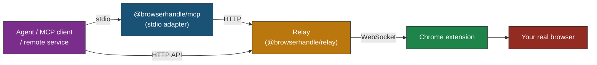

# BrowserHandle

[](https://github.com/andrewshi98/browser-handle/actions/workflows/ci.yml)
[](https://www.npmjs.com/package/@browserhandle/mcp)
[](LICENSE)

**Turn your real Chrome into a live, permissioned handle for AI agents.**

BrowserHandle exposes your browser as a `browser_handle_id` that any agent can drive through raw browser operations — observe, navigate, click, type, scroll, screenshot, evaluate. An agent connects to your logged-in browser through a **relay you control**, locally or across the network.

BrowserHandle is **infrastructure, not an agent.** It does not own the agent loop, define task workflows, or decide the next action. The agent stays the brain; BrowserHandle is the browser actuator.

## Architecture



- The **extension** dials a configured **relay** URL (outbound) and registers a stable `browser_handle_id`.
- The **relay** keeps a registry of connected handles and exposes them over a small HTTP API.
- Agents reach a handle either through the **MCP adapter** (for MCP clients like Claude) or by calling the **HTTP API** directly.
- Behavior is identical whether the relay runs on `localhost` or on a remote host — there is no special "local mode."

Because the extension runs inside your **real Chrome**, it sees exactly what you see: cookies, logins, installed extensions. No headless browser, no CDP injection, no bot flags.

## Quick Start (local)

### 1. Run a relay

```bash
npx @browserhandle/relay        # listens on 127.0.0.1:18080
```

With no tokens on a loopback address, auth is disabled — fine for local development.

### 2. Load the Chrome extension

1. Download the latest [`browserhandle-extension.zip`](https://github.com/andrewshi98/browser-handle/releases/latest) and unzip, **or** build from source (below).
2. Open `chrome://extensions/` → enable **Developer mode** → **Load unpacked** → select the `dist/` folder.
3. Open the side panel. It connects to the default relay (`ws://127.0.0.1:18080/ws/browser`) automatically and shows **Connected**. To point at a different or remote relay, edit **Connection settings** there.

<details>
<summary>Build the extension from source</summary>

```bash
git clone https://github.com/andrewshi98/browser-handle.git
cd browser-handle && pnpm install && pnpm build
```

Then load `packages/extension/dist/` as above.

</details>

### 3. Connect an MCP client

<details open>
<summary><b>Claude Desktop</b></summary>

Add to `claude_desktop_config.json`:

```json
{
  "mcpServers": {
    "browserhandle": {
      "command": "npx",
      "args": ["-y", "@browserhandle/mcp"]
    }
  }
}
```

Config file locations:
- macOS: `~/Library/Application Support/Claude/claude_desktop_config.json`
- Linux: `~/.config/Claude/claude_desktop_config.json`
- Windows: `%APPDATA%\Claude\claude_desktop_config.json`

</details>

<details>
<summary><b>Claude Code</b></summary>

```bash
claude mcp add browserhandle -- npx -y @browserhandle/mcp
```

</details>

<details>
<summary><b>Cursor / Windsurf</b></summary>

Add to `.cursor/mcp.json` (or `~/.codeium/windsurf/mcp_config.json`):

```json
{
  "mcpServers": {
    "browserhandle": {
      "command": "npx",
      "args": ["-y", "@browserhandle/mcp"]
    }
  }
}
```

</details>

<details>
<summary><b>VS Code (Copilot)</b></summary>

Add to `.vscode/mcp.json`:

```json
{
  "servers": {
    "browserhandle": {
      "type": "stdio",
      "command": "npx",
      "args": ["-y", "@browserhandle/mcp"]
    }
  }
}
```

</details>

The adapter talks to the relay at `http://127.0.0.1:18080` by default. With exactly one connected browser it binds automatically; otherwise use `list_browser_handles` / `select_browser_handle`, or pass `--handle <id>`.

### 4. Try it

> **"Go to wikipedia.org and search for Model Context Protocol"**

The side panel shows every action in real time.

## Using the HTTP API directly

The relay is also usable without MCP — any agent or service can drive a handle over HTTP:

```bash
# List connected browsers
curl http://127.0.0.1:18080/v1/handles

# Drive one by id
curl -X POST http://127.0.0.1:18080/v1/handles/<handle_id>/call \
  -H 'content-type: application/json' \
  -d '{"method":"navigate","payload":{"url":"https://example.com"}}'
```

See [docs/protocol.md](docs/protocol.md) for the full wire protocol and method list.

## Page understanding: `page_snapshot`

The content script reads the page as a **compact accessibility tree** with `@ref` labels — no pixel coordinates, no CSS selectors.

```
[page "Wikipedia, the free encyclopedia"]
  [search]
    [form]
      [@e3 searchbox "Search Wikipedia"]    ← AI targets this
      [@e4 button "Search"]                 ← and clicks this
  [main]
    [heading[1] "Welcome to Wikipedia"]
```

Every interactive element gets a stable `@ref` label. The agent reads the tree, picks the right `@ref`, and calls `click` / `type_text` / `select_option`.

## Tools (23)

The MCP adapter exposes raw browser-control tools plus two handle-management tools. The same browser methods are available over the HTTP API.

<details>
<summary><b>Page interaction</b> — navigate, snapshot, click, hover, type, select, drop files, screenshot, dialog, evaluate</summary>

| Tool | Parameters | Description |
|------|-----------|-------------|
| `navigate_to` | `url`, `tabId?` | Navigate to a URL |
| `page_snapshot` | `focusRegion?`, `interactiveOnly?`, `tabId?` | Get a compact accessibility tree with `@ref` labels |
| `click` | `ref`, `snapshotId`, `tabId?` | Click an element by its `@ref` label |
| `hover` | `ref`, `snapshotId`, `tabId?` | Hover to reveal hidden UI (dropdowns, tooltips) |
| `type_text` | `ref`, `text`, `snapshotId`, `clearFirst?`, `tabId?` | Type into an input/textarea by `@ref` |
| `select_option` | `ref`, `value`, `snapshotId`, `tabId?` | Select a dropdown option by `@ref` |
| `drop_files` | `ref`, `snapshotId`, `files`, `tabId?` | Drop files onto an element (uploads) |
| `screenshot` | `tabId?`, `savePath?` | Capture the visible area of the active tab |
| `handle_dialog` | `action`, `promptText?`, `tabId?` | Handle a native dialog (alert/confirm/prompt) |
| `evaluate` | `expression`, `tabId?` | Evaluate JavaScript in the page context |

</details>

<details>
<summary><b>Tab management</b> — new, list, switch, close</summary>

| Tool | Parameters | Description |
|------|-----------|-------------|
| `new_tab` | `url?` | Open a new tab |
| `list_tabs` | | List all open tabs |
| `switch_tab` | `tabId` | Switch to a tab |
| `close_tab` | `tabId` | Close a tab |

</details>

<details>
<summary><b>Navigation</b> — back, forward, reload, wait, scroll</summary>

| Tool | Parameters | Description |
|------|-----------|-------------|
| `go_back` | `tabId?` | Go back |
| `go_forward` | `tabId?` | Go forward |
| `reload` | `tabId?`, `bypassCache?` | Reload the page |
| `wait_for_navigation` | `tabId?`, `timeoutMs?` | Wait for the page to finish loading |
| `scroll_page` | `direction?`, `amount?`, `ref?`, `snapshotId?`, `tabId?` | Scroll the page or to an element |

</details>

<details>
<summary><b>WebMCP</b> — discover and invoke page-declared tools</summary>

| Tool | Parameters | Description |
|------|-----------|-------------|
| `list_webmcp_tools` | `tabId?` | Discover tools on the page (native WebMCP + auto-synthesized) |
| `invoke_webmcp_tool` | `toolName`, `args?`, `tabId?` | Invoke a discovered tool |

</details>

<details>
<summary><b>Handle management</b> — list, select</summary>

| Tool | Parameters | Description |
|------|-----------|-------------|
| `list_browser_handles` | | List browser handles registered on the relay |
| `select_browser_handle` | `handleId` | Bind this session to a specific handle |

</details>

## Deploying a remote relay

The relay is a standalone server you can host anywhere. Set tokens and put it behind a reverse proxy that terminates TLS:

```bash
BROWSERHANDLE_AGENT_TOKEN=… BROWSERHANDLE_BROWSER_TOKEN=… \
  npx @browserhandle/relay --host 0.0.0.0
```

Then point the extension at `wss://relay.example.com/ws/browser` (with the browser token) and the MCP adapter at `https://relay.example.com` (with the agent token). Binding to a non-loopback host **without** both tokens refuses to start.

See [docs/deploying.md](docs/deploying.md) for a reverse-proxy example and [docs/security.md](docs/security.md) for the security model.

## Development

```bash
pnpm install
pnpm build        # build all packages
pnpm test         # run all tests
pnpm dev          # watch mode
node scripts/e2e-smoke.mjs   # full relay + Chrome + MCP smoke test
```

### Project structure

```
packages/
  protocol/   Wire types, Zod schemas, constants (bridge + relay protocol)
  relay/      Standalone relay server (handle registry, HTTP API, WS endpoint)
  client/     Typed HTTP client for the relay's agent API
  mcp/        MCP stdio adapter (browser-control tools over the client)
  extension/  Chrome MV3 extension (service worker, content scripts, side panel)
examples/
  webmcp-demo-site/   WebMCP-enabled demo for native tool discovery
```

### Environment variables

| Variable | Used by | Default | Description |
|----------|---------|---------|-------------|
| `BROWSERHANDLE_PORT` | relay | `18080` | Relay listen port |
| `BROWSERHANDLE_HOST` | relay | `127.0.0.1` | Relay bind host |
| `BROWSERHANDLE_AGENT_TOKEN` | relay, mcp | — | Bearer token for the agent/HTTP surface |
| `BROWSERHANDLE_BROWSER_TOKEN` | relay | — | Token the extension presents when registering |
| `BROWSERHANDLE_TOKEN` | relay, mcp | — | Shorthand: sets both tokens |
| `BROWSERHANDLE_RELAY_URL` | mcp | `http://127.0.0.1:18080` | Relay base URL for the adapter |
| `BROWSERHANDLE_HANDLE_ID` | mcp | — | Bind the adapter to a specific handle |

## Permissions

v1 ships with **no permission enforcement** — every connected agent can drive the browser, and the side panel is a passive activity log. A documented `PolicyGate` seam exists in the extension for a future version to add origin allow/deny lists, tool-category gates, and interactive approval. See [docs/security.md](docs/security.md).

## Acknowledgements

BrowserHandle began as a derivative of [WebClaw](https://github.com/kuroko1t/webclaw) by [kuroko1t](https://github.com/kuroko1t), imported at commit `fa67f87` and reshaped around a relay-based architecture. WebClaw is MIT-licensed and its copyright notice is retained in [LICENSE](LICENSE) and [NOTICE](NOTICE). Thanks to the original author for the snapshot engine, WebMCP discovery, and Chrome extension foundation.

## Disclaimer

BrowserHandle is a browser-control runtime intended for legitimate use such as personal productivity, development, testing, and accessibility. Users are responsible for complying with the terms of service of any website they interact with. The authors are not responsible for misuse.

## License

[MIT](LICENSE)
